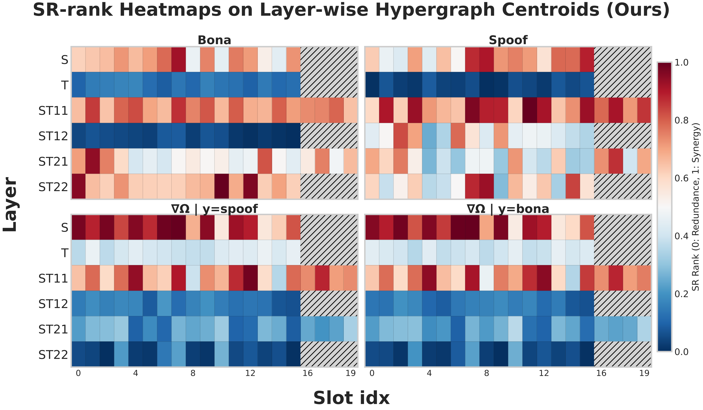

HyperPotter: Spell the Charm of High-Order Interactions in Audio Deepfake Detection
===============
This repository contains the code for the experiments described in the paper. The implementation is provided for reproducibility and review purposes.


## 1. Installation
First, clone the repository locally, create and activate a conda environment, and install the requirements :
```
$ cd Hyperpotter
$ conda env create -f environment.yml
$ cd fairseq-a54021305d6b3c4c5959ac9395135f63202db8f1
(This fairseq folder can be downloaded from https://github.com/pytorch/fairseq/tree/a54021305d6b3c4c5959ac9395135f63202db8f1)
$ pip install --editable ./
$ pip install -U hoi
```


## 2. Experiments

### 2.1 Dataset
Our experiments are performed on the In-The-Wild dataset (train on 2019 LA training and evaluate on In-The-Wild dataset).

The ASVspoof 2019 dataset, which can can be downloaded from [here](https://datashare.is.ed.ac.uk/handle/10283/3336).

In The Wild dataset, which can be downloaded from [here](https://huggingface.co/datasets/mueller91/In-The-Wild)

After downloading datasets above, please modify the absolute path in `./protocols/ASVspoof2019LA.txt` and `./protocols/InTheWild.txt`

### 2.2 Pre-trained wav2vec 2.0 XLSR (300M)
Download the XLSR models from [here](https://github.com/pytorch/fairseq/tree/main/examples/wav2vec/xlsr)

### 2.3 Training on 2019LA
To train the model run:
```
CUDA_VISIBLE_DEVICES=0 python main.py --comment='HyperPotter'
```
### 2.4 Testing on In-The-Wild

To evaluate your own model In-The-Wild dataset:
```
CUDA_VISIBLE_DEVICES=0 python main.py --dev \
--protocols_dev_path='./protocols/InTheWild.txt' \
--model_path='/path/to/model.pth' \
--proto_banks_path='/path/to/proto_bank.pt'
```

We also provide a pre-trained model. To use it you can run: 

```
CUDA_VISIBLE_DEVICES=0 python main.py --dev \
--protocols_dev_path='./protocols/InTheWild.txt' \
--model_path='/path/to/HyperPotter.pth' \
--proto_banks_path='/path/to/proto_bank.pt'
```
Pre-trained HyperPotter model are available [here](https://doi.org/10.5281/zenodo.18377410)

### 2.5 Visualization

We provide a visualization script for generating the high-order interaction heatmap used in our analysis.

To run the visualization:

```bash
CUDA_VISIBLE_DEVICES=0 python oinfo_layer_overview.py \
  --model-path /path/to/HyperPotter.pth \
  --prototype-banks-path /path/to/proto_bank.pt \
  --protocol-files ./protocols/InTheWild.txt \
  --dataset-names ITW \
  --splits - \
  --output-dir ./outputs/oinfo_visualization
```

For multi-dataset analysis:
```bash
CUDA_VISIBLE_DEVICES=0 python oinfo_layer_overview.py \
  --model-path /path/to/model.pth \
  --prototype-banks-path /path/to/proto_banks.pt \
  --protocol-files p1.txt p2.txt \
  --dataset-names ASVspoof ITW \
  --splits eval - \
  --output-dir ./outputs/oinfo_visualization
```
The generated results will be saved to:

```text
outputs/oinfo_visualization/
├── summary.csv
└── ITW/
    ├── sr_rank_heatmap_2x2.png
    ├── summary.json
    └── layer_details.json
```

The main visualization result is `sr_rank_heatmap_2x2.png`.  
An example is shown below:



## 3. Acknowledgements

This work was supported by the Shanghai Municipal Special Program for Basic Research on General AI Foundation Models (Grant No. 2025SHZDZX025G17), in collaboration with Shanghai Artificial Intelligence Laboratory.
